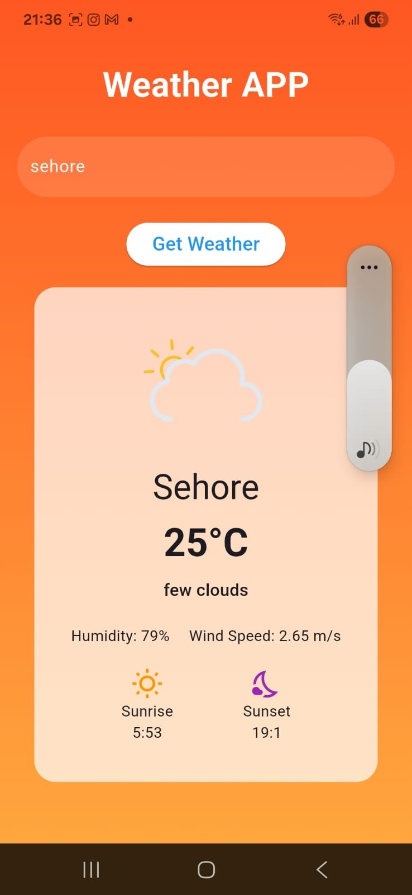

# Weatherly

Weatherly is a Flutter app that fetches real-time weather data using the OpenWeather API.  
It provides a simple, clean interface showing current weather conditions and temperature.

## Features
- Real-time weather updates  
- Clean and responsive UI  
- Supports multiple locations  

## Setup Instructions

1. Clone the repository:  
   ```bash
   git clone https://github.com/PRIYANSHU2569/weatherly.git
````

2. Navigate to the project folder:

   ```bash
   cd weatherly
   ```

3. Install dependencies:

   ```bash
   flutter pub get
   ```

4. Obtain your OpenWeather API key from [https://openweathermap.org/api](https://openweathermap.org/api)

5. Add your API key in the `lib/services/weather_services.dart` file.

6. Run the app:

   ```bash
   flutter run
   ```

## Screenshots



---

Feel free to contribute or raise issues!

---

Made by Priyanshu Gupta


Feel free to contribute or raise issues!

Made by Priyanshu Gupta
